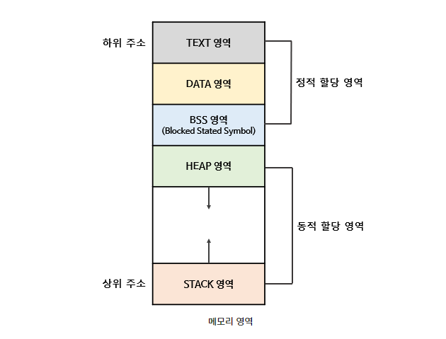
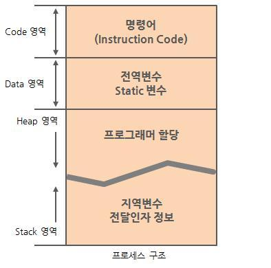
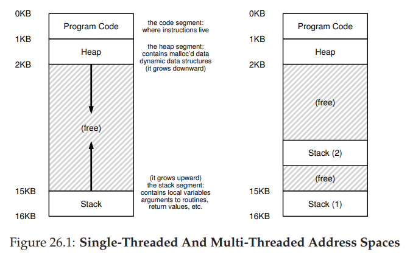
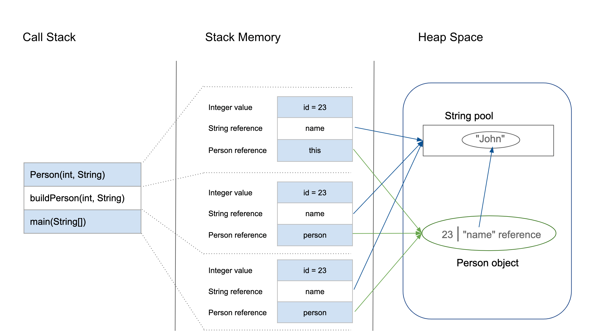

## 프로세스 주소공간
@ 흐느

- 프로세스는 대해 운영체제가 자원을 할당하는 단위로 볼 수 있다.
- 프로세스에게 메모리를 할당하고 이를 관리하기 위해 메모리 공간을 특정한 구조로 관리하게 되는데 이를 가리켜 프로세스 주소 공간이라고 부른다.

### Text (Code) 영역:
- 프로그램이 실행될 수 있도록 CPU가 해석 가능한 기계어 코드가 저장되어 있는 공간으로, 프로그램이 수정되면 안 되므로 ReadOnly 상태로 저장 되어있다.
  
### Heap 영역:
- 런타임에 크기가 결정되는 영역이다.
- 사용자에 의해 공간이 동적으로 할당 및 해제된다. (malloc()이나 new를 사용하였을때)
- 주로 참조형 데이터 (ex. 클래스) 등의 데이터가 할당된다.
- 메모리의 낮은 주소에서 높은 주소의 방향으로 할당된다.
  
### Data 영역:
- 전역 변수나 Static 변수 등 프로그램이 사용할 수 있는 데이터를 저장하는 영역이다.
- 어떤 프로그램에 전역/static 변수를 참조하는 코드가 존재한다면, 이 프로그램은 컴파일 된 후에 data 영역을 참조하게 된다.
- 프로그램의 시작과 함께 할당되며, 프로그램이 종료되면 소멸한다.
- 단, 초기화 되지 않은 변수가 존재한다면, BSS 영역에 저장된다.
  
### Stack 영역:
- 함수의 호출과 관계되는 지역 변수와 매개변수가 저장되는 영역이다.
- Stack 영역의 값은 함수의 호출과 함께 할당되며, 함수의 호출이 완료되면 소멸한다.
- 메모리의 높은 주소에서 낮은 주소의 방향으로 할당된다.
- 재귀 함수가 너무 깊게 호출되거나 함수가 지역변수를 너무 많이 가지고 있어 stack 영역을 초과하면 stack overflow 에러가 발생한다.

### 멀티 스레드의 경우

- 하난의 프로세스 내에 존재하는 각 스레드들은 스택 영역 외 주소 공간을 공유한다.

### 힙과 스택의 관계 (JAVA)

- Stack 영역은 생성과 동시에 크기가 정해진다. 즉, 크기가 한 번 정해지면 바뀌지 않기 때문에, Heap 영역과 상관 없이 크기의 제한을 갖는다.
- Stack 영역에 등장하는 각각의 변수들은 Heap 영역에 위치한 실제 Object의 참조를 갖고 있는 것을 볼 수 있다. 즉, 실제 객체는 Heap 영역에서 관리되기 때문에 Stack 영역의 크기는 생각보다 클 필요가 없다는 것을 알 수 있다.

참고자료)
1. https://velog.io/@cef5787/%EC%9A%B4%EC%98%81%EC%B2%B4%EC%A0%9C-2.-%ED%94%84%EB%A1%9C%EC%84%B8%EC%8A%A4
2. https://velog.io/@klm03025/%EC%9A%B4%EC%98%81%EC%B2%B4%EC%A0%9C-%ED%94%84%EB%A1%9C%EC%84%B8%EC%8A%A4-%EC%A3%BC%EC%86%8C-%EA%B3%B5%EA%B0%84